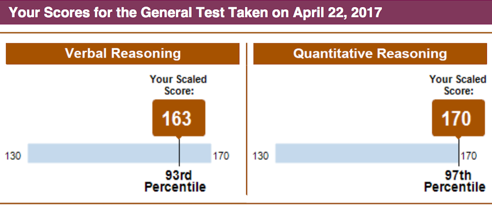

# vocabulary-cli
> Command line tool for vocabulary

As a console lover, you should never let your hands leave the keyboard while memorizing vocabularies.

I write this software to help myself prepare GRE. Through it, I got `163` in my GRE verbal as a non-native speaker.



## Installation
Through [npm](https://www.npmjs.org/):
```sh
npm install -g vocabulary-cli

```
